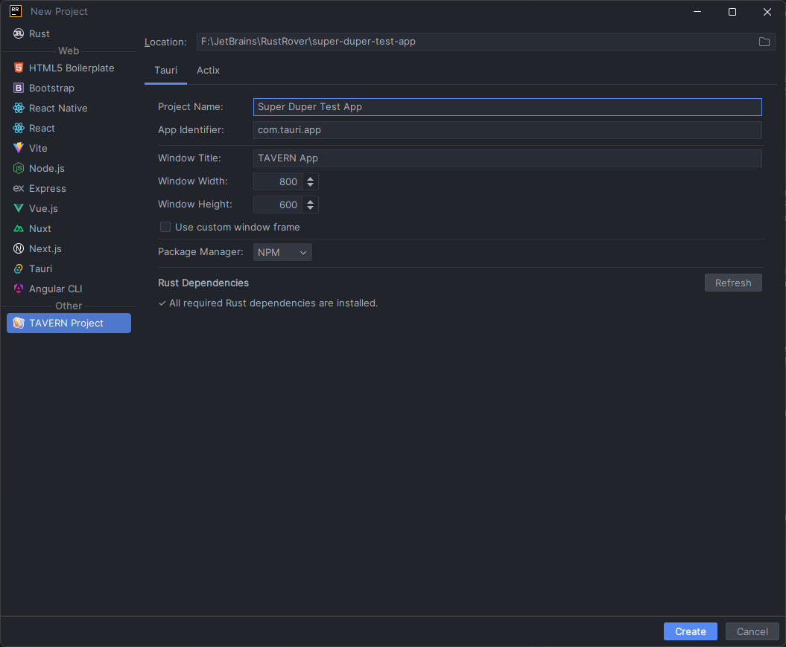
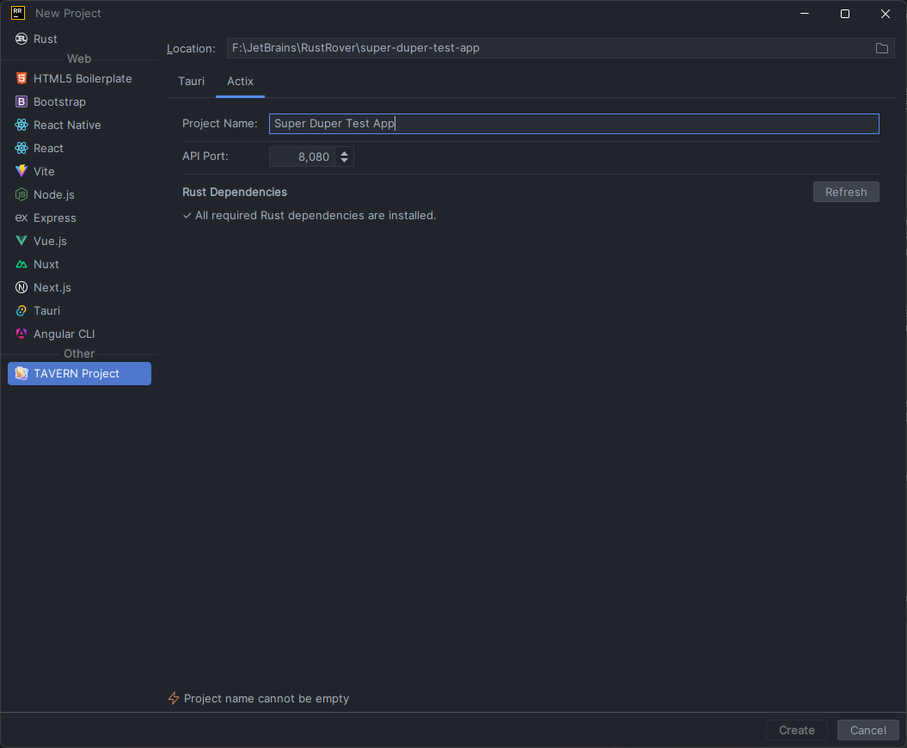

  <h1>TAVERN Project Wizard</h1>
  

A JetBrains RustRover plugin that provides a project wizard for creating TAVERN (Tauri and Actix-based) projects.

## Overview

The TAVERN Project Wizard simplifies the process of creating new TAVERN projects in RustRover. It offers an intuitive interface for configuring and generating both Tauri and Actix-based projects, allowing developers to quickly set up their development environment with the right structure and dependencies.

## Features

- **Easy Project Creation**: Generate TAVERN projects with just a few clicks
- **Multiple Project Types**:
    - **Tauri Projects**: Create desktop applications with web technologies
    - **Actix Projects**: Set up Rust-based web servers
- **Customizable Configuration**:
    - Configure window properties for Tauri applications
    - Set API port for Actix web servers
    - Choose your preferred package manager (NPM, Yarn, PNPM)
- **Seamless Integration**: Works natively within RustRover IDE

## Screenshots

### Tauri Project Configuration

### Actix Project Configuration

## Installation

1. Open RustRover IDE
2. Go to **Settings** → **Plugins** → **Marketplace**
3. Search for "TAVERN Project"
4. Click **Install**
5. Restart RustRover when prompted

## Requirements

- RustRover IDE (2025.1 or later)
- Rust and Cargo installed
- cargo-generate installed (`cargo install cargo-generate`)
- For Tauri projects: Node.js and a package manager (npm, yarn, or pnpm)

## Usage

1. Open RustRover
2. Select **New Project** from the welcome screen or **File** → **New** → **Project**
3. Select **TAVERN Project** from the project types
4. Choose between Tauri or Actix project type
5. Configure your project settings:
    - **For Tauri projects**:
        - App Identifier (e.g., com.example.app)
        - Window Title
        - Window Dimensions (width and height)
        - Custom Chrome option
        - Package Manager (NPM, Yarn, or PNPM)
    - **For Actix projects**:
        - API Port
6. Click **Create** to generate your project

## Configuration Options

### Tauri Projects

| Option          | Description                                          | Default       |
|-----------------|------------------------------------------------------|---------------|
| App Identifier  | The unique identifier for your application           | com.tauri.app |
| Window Title    | The title displayed in the application window        | TAVERN App    |
| Window Width    | The initial width of the application window          | 800           |
| Window Height   | The initial height of the application window         | 600           |
| Custom Chrome   | Whether to use custom window chrome                  | false         |
| Package Manager | The package manager to use for frontend dependencies | NPM           |

### Actix Projects

| Option   | Description                                        | Default |
|----------|----------------------------------------------------|---------|
| API Port | The port on which the Actix web server will listen | 8080    |

## How It Works

The plugin uses [cargo-generate](https://github.com/cargo-generate/cargo-generate) to create projects from the [Drew-Chase/tavern-cargo-template](https://github.com/Drew-Chase/tavern-cargo-template) repository. It passes your configuration options to the template to customize the generated project.

## Troubleshooting

- **Error: Cargo is not installed**: Install Rust and Cargo from [https://rustup.rs/](https://rustup.rs/)
- **Error: cargo-generate is not installed**: Run `cargo install cargo-generate` in your terminal
- **Project generation fails**: Ensure you have an active internet connection and the required dependencies installed

## License

This project is licensed under the MIT License - see the LICENSE file for details.

## Author

[Drew Chase](https://github.com/drew-chase)